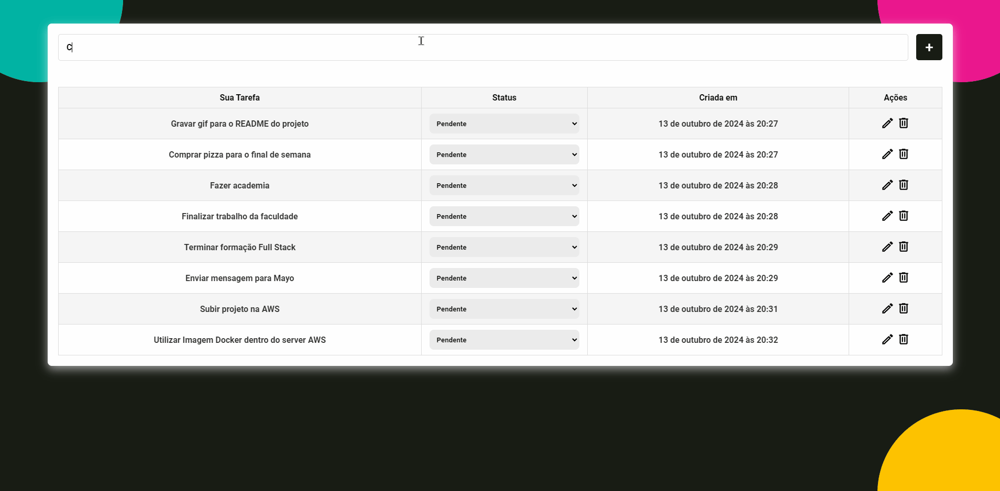

# Full Stack To do List 📘

<div>
    
</div>

#### Funcionalidades da plataforma 🚀

- Adicionar uma nova tarefa (Clicando Enter ou no Ícone);

- Alterar Status dentre (Pendente, Em Andamento, Concluído);

- Verificar a data exata que a tarefa foi criada;

- Editar uma tarefa de forma persistente;

- Excluir uma tarefa de forma definitiva;

- Integração com banco de dados MySQL;

- Autenticações para todas as funcionalidades do projeto;

- Integração com sistema Redis cache, melhorando o desempenho de recarregamento da página em 50% conforme dados do fornecidos no navegador;

#### Tecnologias utilizadas neste projeto 🤖

- [](#)
- [](#)
- [](#)
- [](#)
- [](#)
- [](#)
- [](#)
- [](#)
- [](#)
- [](#)

### Dependências ou tecnologias para auxiliar o desenvolvimento:

```bash
Nodemon, Dotenv, Eslint, Docker, Insomnia
```

#### Problemas encontrados no processo 🤓

❌ Instalação da extensão Database:

- (Solução✅): Gostaria de utilizar a extensão por motivos de praticidade, contudo a IDE do VS Code não estava permitindo, sendo assim pesquisei e vi um tutorial de como baixar manualmente;

❌ Erro MySQL port 3306 already in use:

- (Solução✅): Depois de muita pesquisa, percebi que já estava outro serviço MySQL rodando em minha máquina o que estava dando conflito com a imagem do MySQL no Docker, então tive que redirecionar de forma manual e parar o MySQL que estava rodando localmente;

❌ Erro MySQL Error 1045 Access denied:

- (Solução✅): Após pesquisar tive que redirecionar o caminho de forma correta dentro das variáveis de ambiente da minha máquina;

❌ AWS SSH:

- (Solução✅): Não estava conseguindo clonar meu repositório na máquina virtual Ubuntu dentro da AWS, então após muitos vídeos e grande ajuda de estrangeiro da Índia, tive que instalar o Open SSH no meu Windows e criar uma chave de acesso para o meu GitHub;

#### Como Iniciar o projeto

- 1° Primeiro instale o projeto, depois siga esses 2 comandos;

```bash
cd backend
npm install
```

- 2° Certifique-se de estar com MySQL e Redis instalados em sua maquina ou rodando virtualmente com docker;

- 3° Após estar com todas as dependencias instaladas bastar iniciar o backend com o script criado;

```bash
npm start
```

- 4° Iniciar o front, basta clicar no link abaixo ou iniciar de forma local utilizando o index.html (Recomendo utilizar a extensão "Live Server" caso queria iniciar a operação local)

<div>
    <a href="https://full-stack-to-do-list-node.vercel.app" target="_blank"></a>
</div>

#### Recado final

|-------------------------------------------------------------------------------------------------------------------|

Primeiramente quero agradecer esta oportunidade incrível de participar do processo seletivo, foi uma ótima experiência estar em desenvolvimento deste projeto para a Mayo tive oportunidade de conhecer novas pessoas durante esta trajetória, estou deixando todos os meus contatos abaixo, pois quero receber seu feedback para saber quais aspectos da minha aplicação pode ser aprimorado. Fico à disposição e mais uma vez obrigado.

|-------------------------------------------------------------------------------------------------------------------|

<div> 
    <a href="https://www.linkedin.com/in/vinicius-ribeiro-4690741ba/" target="_blank"></a>
    <a href="https://wa.me/5511943232223" target="_blank"></a>
    <a href="www.youtube.com/@Devdebotas" target="_blank"></a>
    <a href="vinii.viniciusribeiro@gmail.com" target="_blank"></a> 
    <h2>vinii.viniciusribeiro@gmail.com</h2>
</div>
